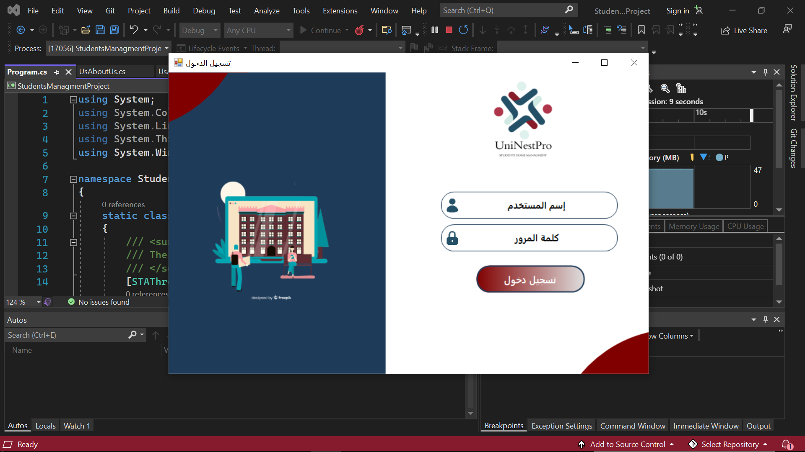
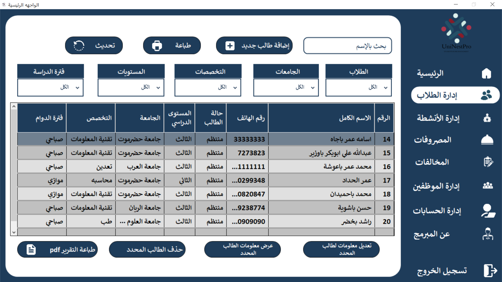
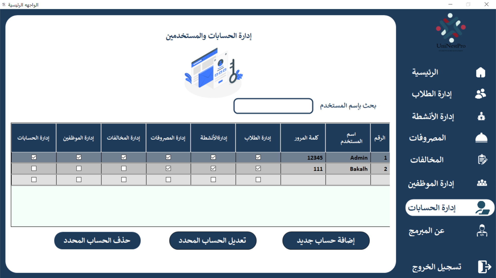
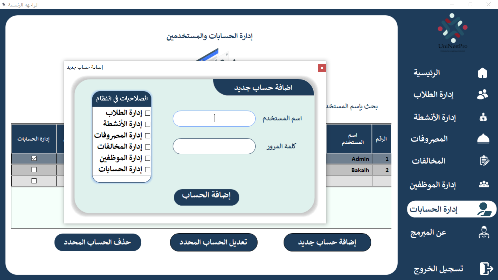
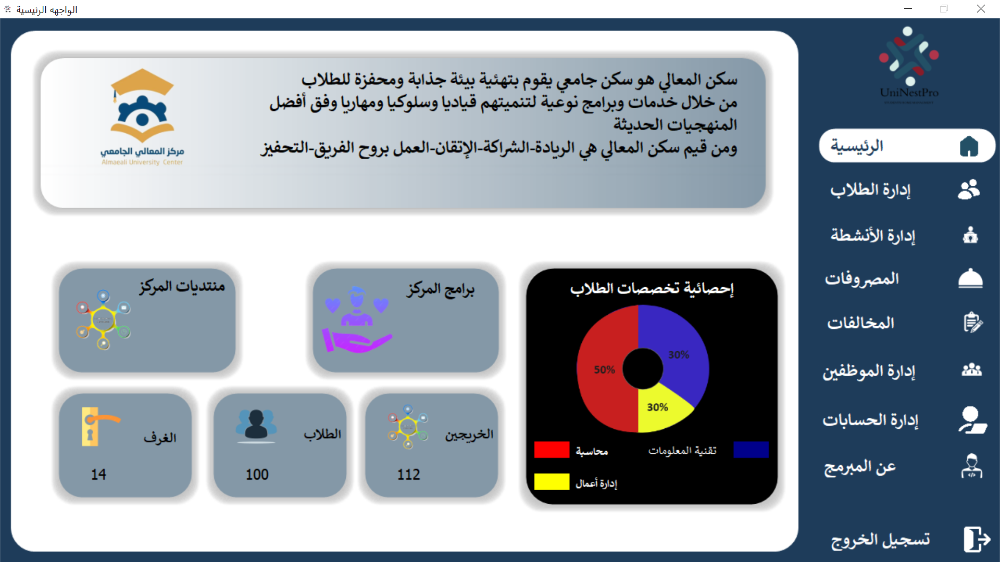
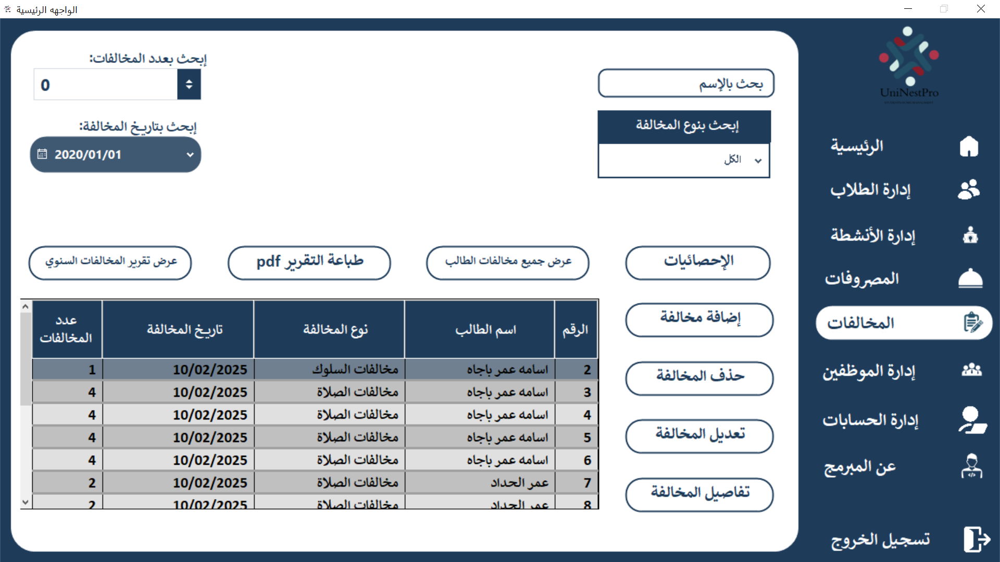
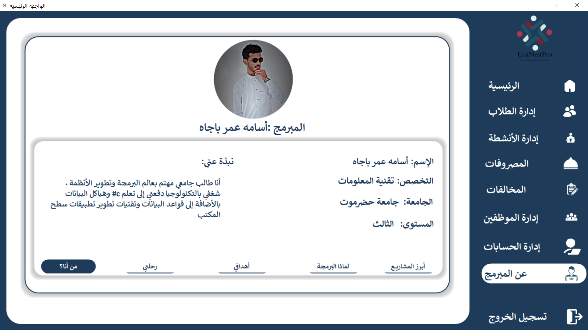
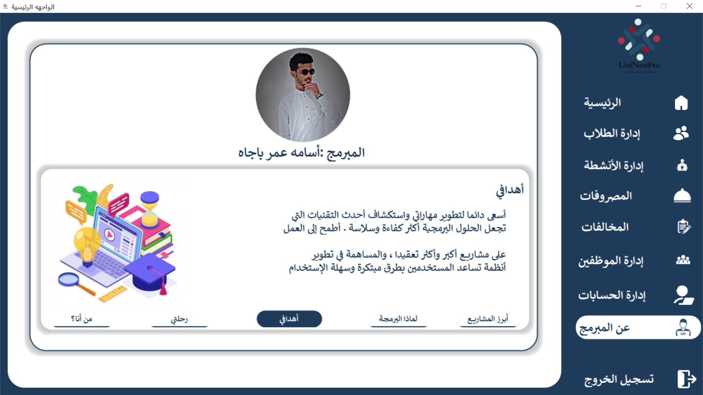

# 🏢 Student Housing Management System | نظام إدارة السكنات الطلابية

نظام مكتبي احترافي متكامل يهدف إلى **إدارة السكنات الطلابية بكفاءة عالية**، ويعتمد على هيكل برمجي قوي باستخدام **3-Tier Architecture**.  
تم تطويره باستخدام C# و Windows Forms، مع دعم قوي لقواعد البيانات، ويغطي جوانب متعددة من إدارة السكن الأكاديمي.

---

## 🎯 الهدف من المشروع

يوفر هذا النظام حلاً متكاملاً لإدارة الجوانب الإدارية والمالية في سكن الطلاب، من تتبع الطلاب والمخالفات، إلى إدارة الموظفين، وحساب المصروفات والتغذية بشكل دقيق وسلس.

---

## 📌 أبرز الخصائص

- 👨‍🎓 **إدارة بيانات الطلاب**: تسجيل وتحديث بيانات الساكنين، تتبع التسكين.
- 🚫 **تسجيل المخالفات الطلابية**: نظام متكامل لرصد وتحليل المخالفات.
- 👨‍💼 **إدارة الموظفين**: إضافة وتحديث سجلات موظفي السكن.
- 🔐 **نظام صلاحيات المستخدمين**: لكل مستخدم صلاحيات محددة حسب نوع الحساب.
- 💰 **حساب المصروفات الشهرية**: إدارة مالية دقيقة مع تقارير مفصلة.
- 🍽️ **متابعة حسابات التغذية**: تنظيم ميزانية التغذية حسب الطالب أو المجموعة.
- 🏗️ **بنية معمارية قوية (3-Tier Architecture)**: فصل واضح بين طبقات العرض، البيانات، والمنطق.
- 📚 **استخدام مكتبة Newtonsoft.Json (Json.NET)**: لمعالجة وتحليل البيانات بشكل مرن وسلس.

---

## 🛠️ التقنيات المستخدمة

| التقنية               | الاستخدام                               |
|-----------------------|------------------------------------------|
| 🧠 C#                 | اللغة الأساسية لتطوير النظام           |
| 🪟 Windows Forms       | تصميم واجهة المستخدم                     |
| 🗃️ SQL Server         | تخزين وإدارة البيانات                   |
| 🧱 3-Tier Architecture | تنظيم الكود وضمان القابلية للتوسعة      |
| 📦 Json.NET (Newtonsoft) | معالجة البيانات بصيغة JSON              |

---

## 📸 لقطات من النظام

## 🚀 طريقة التشغيل

1. حمل المشروع (Clone or Download).
2. افتح الملف في Visual Studio.
3. تأكد من ربط قاعدة البيانات.
4. قم بالدخول للنظام من حساب الادمن في قاعدة البيانات
4. شغّل المشروع وابدأ بإضافة بيانات الطلاب!

## 📬 تواصل معي

لو أعجبك المشروع، لا تنسَ تعمل ⭐  
وأي اقتراح أو تطوير، الباب مفتوح دائمًا! 💬
